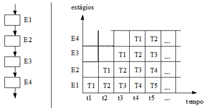

# Arquitetura Paralela
Pipeline - Paralelismo Temporal - Implica na execução de eventos sobrepostos no tempo, tecnica que permite que o processador busca instruções além da próxima, armazendo em memória para execução.  
> Paralelismo Espacial - Paralelismo real
## Memória Cache do Processador
Sai buscando dados e salvando no cache, por isso o processador passou a ter essa memória.  
O processador sai salvando as informações nele, e aí quando precisa ele puxa de um lugar mais próximo e rápido.  
Quando o processador não encontra no cache, ele vai buscar na RAM e dá uma engasgada, aí que entra a ideia de HyperThread.  

> Pipeline - Tenta dividir a execução em várias partes, cada parte especializada em algo

O paralelismo permite executar partes diferentes de diferentes instruções no mesmo ciclo de clock.  

Exemplo sem pipeline: Executamos os processos um após o outro, esperando o processo finalizar completamente.  
Exemplo com pipeline: Separando uma tarefa em 4 estágios, se só podemos rodar um estágio por vez, ao invés de esperar tudo acabar para fazer de novo, podemos esperar um estágio terminar e logo após iniciar outro processo igual.  

## Classificação de Flynn
* SISD - Single Instruction Single Data
    * Programas tradicionais, as instruções vão sendo executadas e um por um vão alterando os valores das variáveis
* SIMD - Single Instruction Multiple Data
    * Múltiplos processadores escravos sob controle de um processador mestre, executando simultaneamente a mesma instrução em diversos conjuntos de dados.
    * Exemplo: Processamento de imagens e matrizes
    * Soma de vetores, em que cada processador roda a mesma instrução, mas mexe em outro item do vetor
* MISD - Multiple Instruction Single Data
    * Multiplos processadores executando diferentes instruções em um único conjunto de dados
    * Até hoje não tem nenhuma arquitetura que represente essa classe, mas o Pipeline seria próximo, com várias instruções mexendo nos mesmos dados, mas como não é exatamente a mesma informação ao mesmo tempo, acaba não sendo considerado
* MIMD - Multiple Instruction Multiple Data
    * Engloba as arquiteturas paralelas em geral
    * Instruções diferentes gerando dados diferentes

## Classificação de Duncan
* Síncronas - Executa ao mesmo tempo para manter sincronismo
* Assíncronas - Quando não precisa executar ao mesmo tempo