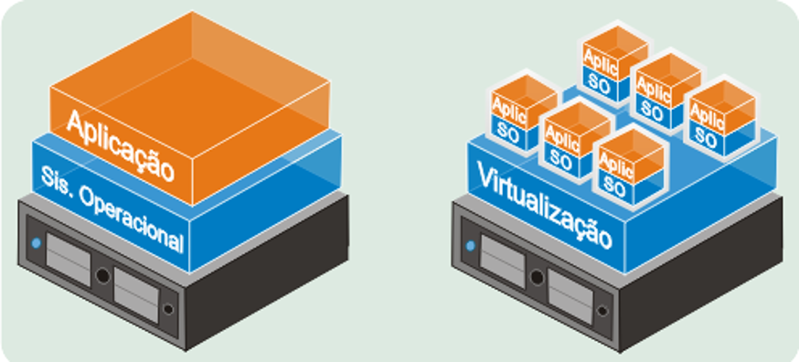

# Aula de Arquitetura Virtual

**Virtualização** - Forma de separar software e hardware
Sem isso, caso queira melhorar a sua máquina precisa fazer upgrade vertical, melhorar o equipamento
Tinha um hardware com um software rodando em cima

Com ela, temos a ideia de um software rodando em cima de um SO que se comunica com a virtualização ao invés da máquina real
Essa virtualização por si que se comunica com a infraestrutura, que pode se compor de mais de uma máquina
Permite fazer upgrade horizontal, com os cluster de máquinas, só aumentar a qtd de máquinas

> Abstração do hardware, uma camada de software que simula uma infraestrutura física, entre o hardware (real) e o SO

>Virtualização é uma tecnologia que permite uma melhor separação de componentes de uma arquitetura
>Podemos ter mais de um SO se comunicando com a mesma infraestrutura

* Máquinas Virtuais
* SDS - Software Defined Storage
* SDN - Software Defined Networking

* SDDC - Software Defined Data Center

O software que permite máquinas virtuais é o **Hypervisor**
(VMM - Virtual Machine Monitor)
* Hyper-V
* VMWare
* VirtualBox