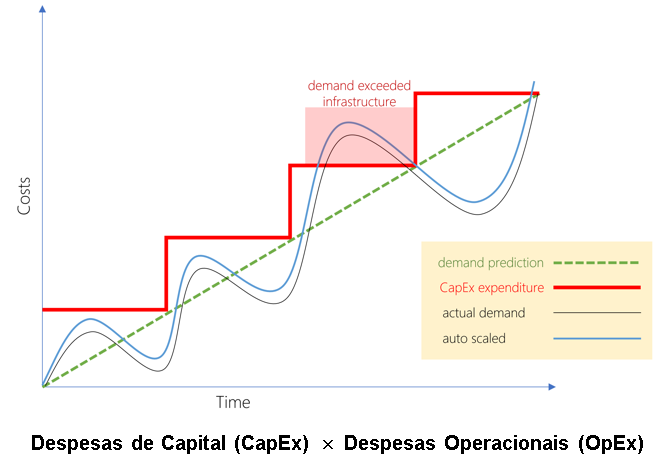
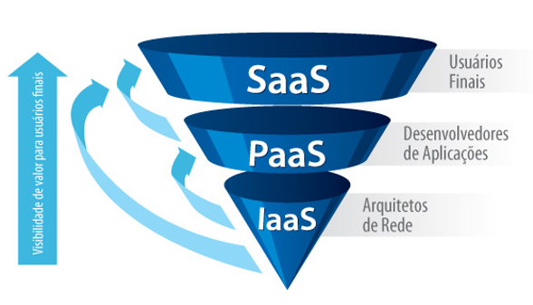
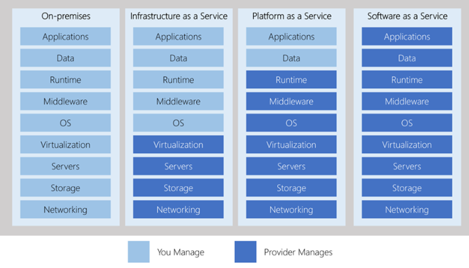

# Cloud Computing
Entre sob demanda de poder computacional, banco de dados, armazenamento, aplicações e entre outros recursos de TI pela internet, com uma definição de preço conforme uso.  
Passamos então a pensar na infraestrutura de hardware como um software  
1. Infraestrutura como Hardware:
    * Exibe espaço físico, segurança, equipe para manter, manutenção, energia etc.
    * Ciclo longo de aquisição de hardware (demora para comprar e preparar)
    * É necessário tentar prever os picos máximos, calcular etc.
2. Infra como Software:
    * São flexíveis
    * Mudam com velocidade, facilidade, economia. Só aumentar uso que vc já ganha mais CPU, memória etc.
    * Não precisa mais se preocupar com instalação de SO, antivirus, capacidade, manutenção etc.
## Benefícios

Assim como podemos ver na imagem, quando temos que cuidar de um hardware precisamos prever as necessidades operacionais e então comprar uma máquina com capacidade acima. Correndo o risco de não ser suficiente, precisando fazer grandes aquisições para isso.  
Já usando Infra como Software é fácil isso, é só configurar e pagar imediatamente o valor adicional necessário para a capacidade necessária.  
### Modelo de Negócio
Pagamos só pelos serviços usados, e as empresas que possibilitam isso são os provedores de núvem.
* IaaS (Infraestutura como Serviço)
    O bruto como serviço, a máquina, o disco etc.
    * Computação
    * Armazenamento
    * Rede
* PaaS (Plataforma como Serviço)
    Um banco de dados, algo mais sofisticado.
    * Armazenamento de Objetos
    * Identidade
    * Motor de Execução
    * Filas
    * Base de Dados
* SaaS (Software como Serviço)
    Uma aplicação que resolve um problema
    * Monitorização
    * Conteúdo
    * Colaboração
    * Comunicação
    * Finança
Lembrando que é possível acessar tudo isso a partir de qualquer dispositivo
### Infraestrutura como Serviço - IaaS
Serviço de mais alta flexibilidade e controle sobre os recursos.  
Podemos configurar, instalar o que precisamos, adicionar o que queremos etc.  
* AWS
* Dell Cloud
* Locaweb
* Rackspace
### Plataforma como Serviço - PaaS
Quando precisamos de algo mais específico, não uma máquina, um banco de dados, um processador de criptografia etc.
* Heroku
* Oracle
* Azure
* Google
### Software como Serviço - SaaS
Produto completo disponível, executado e gerenciado pelo provedor de nuvem.  
Aplicações de usuário final. Mais complicado de modificar, usamos ele e se ele permite, tudo bem, caso contrário não tem o que fazer.  
Utilizamos da mesma forma em qualquer lugar.  
Favorece o Rapid Application Development - RAD - Só nos concentramos na aplicação e nos dados, o resto é do provedor de núvem.  
* Spotify
* Netflix
* Salesforce
* Gmail
* Office
### Modelos de Serviços em Núvem

