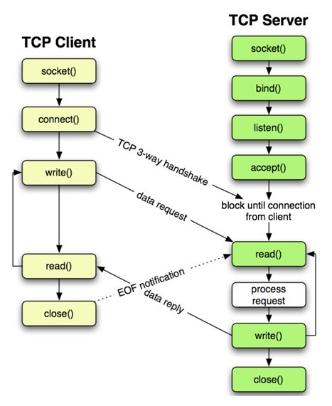
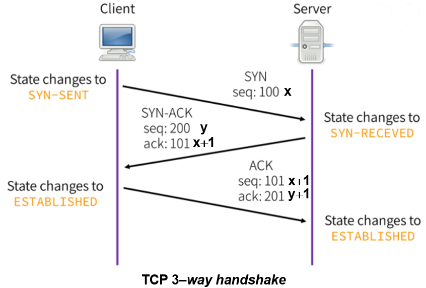

# Sockets
Socket: Ponto final de um fluxo de comunicação entre processos através de um network.  
SO costumam oferecer funções necessárias para usar os sockets (Berkeley sockets)  

* Socket Address: Combinação de IP e de uma porta (tcp ou udp)

## TCP e UDP
O primeiro estabelesce conexão (controle de erros e tals) e a segunda não (só manda o dado)
* TCP: Datastream
* UDP: Datagram

Cliente Socket: Cliente Output Stream -> Server Input Stream: Server Socket  
Server Socket: Server Output Stream -> Client Input Stream  

### Portas
* 0 - 1023 -> Portas conhecidas ou de sistemas
* 1024 - 49151 -> Portas registradas (IANA)
* 49152 - 65535 -> Privadas ou customizadas

Cada porta conhecida possuem um serviço associado, assim como a sua especificação (RFC).  
A maioria delas costumam trabalhar tanto com TCP quanto com UDP. Apenas UDP é raro.  
  
Uma porta registrada conhecida é a 3306, registrada pelo MySQL database.  
  

### Fluxo de Comunicação (API)
* socket() - Cria um novo descritor para comunicação
* connect() - Inicia conexão com o servidor
* write() - Escreve dados na conexão
* read() - Lê dados da conexão
* close() - fecha a conexão e devolve o recurso ao SO
* bind() - atribui IP e porta a um socket
* listen() - coloca o socket em modo passiva
* accept() - bloqueia até a chegada da req. de conexão
* recvfrom() - UDP - Recebe
* sendto() - UDP - Envia