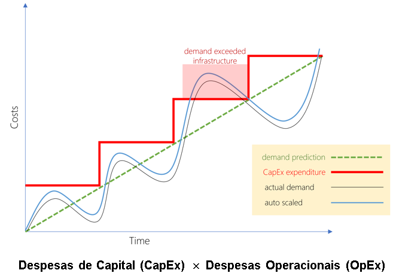

# Web Services
Arquitetura de Web Services (não é uma arquitetura exatamente)  
Estratégia, ou conjunto de princípios de boas práticas ou orientação  
Para direcionar o desenvolvimento em Web Services  

## Exemplo do WebService CPTEC/INPE
Informa diversos dados sobre a previsão de tempo  
Centro de Previsão de Tempo e Estudos Climáticos / Instituo Nacional de Pesquisas Espaciais  
Como compreender os dados retornados?  
WSDL (Web Services Description Language)
UDDI (Universal Description, Discovery and Integration) - Publicação e descobrimento dos serviços

## Power Query
Recurso do Excel capaz de realizar requisições e exibir elas de forma clara  
Exemplo de XML no arquivo Web Services v1.6.xlsx  

## Benefícios

Provedores de Nuvem fornecessem esse negócio de autoscale  
Nós somos os clientes  

## Modelos de Serviço em Nuvem
IaaS, PaaS, SaaS - Além das especializações, como Storage, Banco de dados ou Testes as a Service  
* On-premises -> Modelo tradicional, em que tudo é sustentado pela empresa, gerenciado por ela, pago por ela.  
  
> Vacina: Conjunto de valores Hexadecimais que identificam um vírus de PC - Quando a infraestrutura é parte do serviço, provavelmente o provedor já cuida de antivirus etc.  
  
## Tipos de Nuvem
* **Pública**  
    Não há discriminação, desde que aceite os contratos e pague pode usar.  
    * Infra é por conta do provedor de núvem (sem despesa de capital para iniciar um negócio)
    * Modelo escalável que acompanha as demandas e cresce junto
    * Sem desperdício de recursos, paga-se de acordo com o uso  
      
    Porém
      
    * Requisitos específicos de segurança podem não ser atendidos (exemplo, bancos não costumam usar, porque usam um tipo de criptografia X)
    * Políticas governamentais, padrões de mercado ou requisitos legais podem não ser atendidos
        * Dados sensíveis dos clientes podem acabar ficando em um lugar não legal
    * Requisitos comerciais, como manutenção de sistemas legados, pode não ser atendido
* **Privada**  
    Quando uma empresa constrói a sua infra própria, mas usa ela no mesmo modelo de negócio dos provedores de núvem  
    * Maior liberdade para personalização de serviços
    * Maior controle sobre toda a operação (consegue criar uma VM e associar com etiquetas para separar os custos, necessidades)
    * Eventuais requisitos de negócio específicos podem ser atendidos (se quiser fazer algo diferente, pode aplicar)  
      
    Porém  
      
    * Maior investimento inicial
    * Limitações de escalabilidade, porque a empresa vai precisar de aquisições prevendo o crescimento (os provedores de núvem públicos prevem algo muito além)
    * Necessidade de profissionais de TI para a manutenção
* **Híbrida**  
    Reúne as principais vantagens dos dois tipos anteriores. Por exemplo, só o banco de dados fica em uma privada, mas os demais podem ficar na pública.

## AWS versus TI Tradicional
