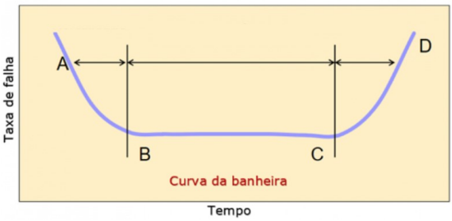
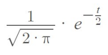

# Checkpoint - Tolerância a Falha em Sistemas Distribuídos
Alunos:
* Gabriel Kazuki Onishi. RM 87182.
* ...

## Questões

1. (1,0 ponto) Em termos de hardware, a transparência a falha relacionasse com quais outras transparências?
    * (A) transparência de acesso e transparência de relocação
    * (B) transparência de replicação e transparência de relocação
    * (C) transparência de acesso e transparência de concorrência
    * (D) transparência de migração e transparência de concorrência
    * (E) transparência de acesso e transparência de replicação  
**Resposta: Alternativa (B)**, pois as transparências de replicação e relocação permitem com que, em caso de falha, outras instâncias da mesma aplicação sejam acionadas para responder aos usuários, portanto, envolvendo uma replicação e a relocação do recurso em uso pelo usuário.

2. (1,0 ponto) Sobre um determinado sistema que fica fora do ar por um milissegundo a cada hora, pode-se afirmar que:
    * (A) Trata-se de um sistema de alta confiabilidade, mas disponibilidade muito baixa.
    * (B) Trata-se de um sistema de alta disponibilidade e alta confiabilidade.
    * (C) Trata-se de um sistema de baixa disponibilidade e baixa confiabilidade.
    * (D) Trata-se de um sistema de alta disponibilidade, mas confiabilidade muito baixa.
    * (E) Para inferir algo sobre a disponibilidade e a confiabilidade deste sistema será necessário acompanhar a operação dele por, pelo menos, 24 horas.  
**Resposta: Alternativa (D)**, pois os instantes de tempo em que o sistema estará fora do ar é muito pouco, trazendo uma alta disponibilidade, porém o sistema apenas apresenta um intervalo de 1 hora em que estará funcionando sem falhar, o que representa uma baixa confiabilidade.

3. (1,0 ponto) Na análise de sistemas de alta disponibilidade, qual alternativa apresenta uma espécie de padrão da indústria de tecnologia?
    * (A) Six Sigma
    * (B) Regra dos Nove
    * (C) Kaizen
    * (D) Programa 5S
    * (E) KPI (Key Performance Indicator) 
**Resposta: Alternativa (B)** - Regra dos Nove. Representam os famosos 99.99% de disponibilidade que os sistemas garantem ao vender o seu produto.

4. (1,0 ponto) Na figura abaixo, tem-se alguns exemplos de sistemas nos quais, se “algo” deixar de funcionar corretamente durante um certo tempo, nada de catastrófico deve acontecer. Em inglês, sistemas deste tipo são chamados de: 

    * (A) no fail-operational systems
    * (B) security-critical systems
    * (C) zero fail-operational systems
    * (D) safety-critical systems
    * (E) mission-critical systems  
**Resposta: Alternativa (D)** - safety-critical systems.

5. (1,0 ponto) Considere a seguinte situação: Em um determinado computador, a fonte de alimentação apresenta um problema que altera a tensão de alimentação da placa-mãe. Por causa disso, alguns bits da memória RAM passam a ter os seus valores trocados de 1 para 0, impossibilitando o boot deste computador. Em relação aos conceitos de falha, erro e disfunção, assinale a alternativa INCORRETA:
    * (A) o problema na fonte de alimentação é uma falha
    * (B) o problema na fonte de alimentação é uma disfunção
    * (C) o problema na memória RAM é um erro
    * (D) o problema na memória RAM é um problema em um subsistema do computador
    * (E) o computador não conseguir dar boot é uma disfunção  
**Resposta: Alternativa (B)**, pois o problema na fonte de alimentação é uma falha, ou seja, a causa do problema, e não uma disfunção (aquilo que percebemos por conta do problema, já que não percebemos visualmente o problema na fonte de alimentação).

6. (1,0 ponto) Considerando-se a figura abaixo, conhecida como “curva da banheira”, a situação na qual um componente eletrônico de um equipamento apresente uma falha na região A–B é chamada de: 

    * (A) mortalidade infantil
    * (B) erro precoce
    * (C) falha imediata
    * (D) morte precoce
    * (E) problema imediato  
**Resposta: Alternativa (A)**

7. (1,0 ponto) Considere que um sistema seja constituído por três componentes montados em série que funcionam de forma independente. Para cada um desses componentes, a probabilidade de que uma falha ocorra até o tempo t é dada pela expressão abaixo (t > 0). Como os componentes são montados em série, o sistema falha caso qualquer um dos três componentes falhe. Considerando a situação apresentada, qual é a probabilidade de que o sistema falhe até o tempo t?

