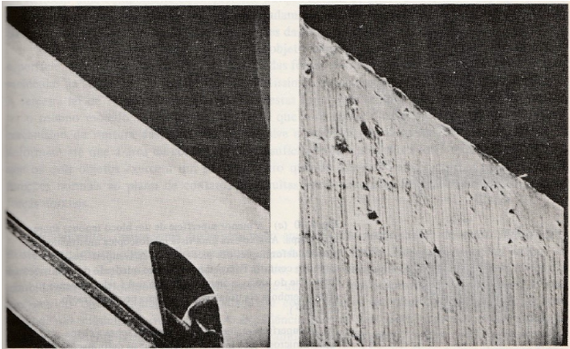

# Checkpoint - Tolerância a Falha em Sistemas Distribuídos
Professor: **Sérgio Ricardo Rota**.  
Alunos:
* **Gabriel Kazuki Onishi. RM 87182.**
* **Breno de Souza Silva. RM 88332.**
* **Felipe Otto da Silva. RM 89108.**
* **Pedro Martins Procopio Argentati. RM 88246.**
* **Rafael Tannous. RM 87486.**

## Questões

1. (1,0 ponto) Em termos de hardware, a transparência a falha relacionasse com quais outras transparências?
    * (A) transparência de acesso e transparência de relocação
    * (B) transparência de replicação e transparência de relocação
    * (C) transparência de acesso e transparência de concorrência
    * (D) transparência de migração e transparência de concorrência
    * (E) transparência de acesso e transparência de replicação  
**Resposta: Alternativa (E)**, pois as transparências de acesso e replicação permitem com que, em caso de falha, outras instâncias da mesma aplicação sejam acionadas para responder aos usuários, portanto, envolvendo uma replicação para manter a aplicação funcionando, e um acesso transparente ao recurso sem que o usuário perceba a falha.

2. (1,0 ponto) Sobre um determinado sistema que fica fora do ar por um milissegundo a cada hora, pode-se afirmar que:
    * (A) Trata-se de um sistema de alta confiabilidade, mas disponibilidade muito baixa.
    * (B) Trata-se de um sistema de alta disponibilidade e alta confiabilidade.
    * (C) Trata-se de um sistema de baixa disponibilidade e baixa confiabilidade.
    * (D) Trata-se de um sistema de alta disponibilidade, mas confiabilidade muito baixa.
    * (E) Para inferir algo sobre a disponibilidade e a confiabilidade deste sistema será necessário acompanhar a operação dele por, pelo menos, 24 horas.  
**Resposta: Alternativa (D)**, pois os instantes de tempo em que o sistema estará fora do ar é muito pouco, trazendo uma alta disponibilidade, porém o sistema apenas apresenta um intervalo de 1 hora em que estará funcionando sem falhar, o que representa uma baixa confiabilidade.

3. (1,0 ponto) Na análise de sistemas de alta disponibilidade, qual alternativa apresenta uma espécie de padrão da indústria de tecnologia?
    * (A) Six Sigma
    * (B) Regra dos Nove
    * (C) Kaizen
    * (D) Programa 5S
    * (E) KPI (Key Performance Indicator)  
**Resposta: Alternativa (B)** - Regra dos Nove. Representam os famosos 99.99% de disponibilidade que os sistemas garantem ao vender o seu produto.

4. (1,0 ponto) Na figura abaixo, tem-se alguns exemplos de sistemas nos quais, se “algo” deixar de funcionar corretamente durante um certo tempo, nada de catastrófico deve acontecer. Em inglês, sistemas deste tipo são chamados de:  

    * (A) no fail-operational systems
    * (B) security-critical systems
    * (C) zero fail-operational systems
    * (D) safety-critical systems
    * (E) mission-critical systems  
**Resposta: Alternativa (D)** - safety-critical systems.

5. (1,0 ponto) Considere a seguinte situação: Em um determinado computador, a fonte de alimentação apresenta um problema que altera a tensão de alimentação da placa-mãe. Por causa disso, alguns bits da memória RAM passam a ter os seus valores trocados de 1 para 0, impossibilitando o boot deste computador. Em relação aos conceitos de falha, erro e disfunção, assinale a alternativa INCORRETA:
    * (A) o problema na fonte de alimentação é uma falha
    * (B) o problema na fonte de alimentação é uma disfunção
    * (C) o problema na memória RAM é um erro
    * (D) o problema na memória RAM é um problema em um subsistema do computador
    * (E) o computador não conseguir dar boot é uma disfunção  
**Resposta: Alternativa (B)**, pois o problema na fonte de alimentação é uma falha, ou seja, a causa do problema, e não uma disfunção (aquilo que percebemos por conta do problema, já que não percebemos visualmente o problema na fonte de alimentação).

6. (1,0 ponto) Considerando-se a figura abaixo, conhecida como “curva da banheira”, a situação na qual um componente eletrônico de um equipamento apresente uma falha na região A–B é chamada de:  

    * (A) mortalidade infantil
    * (B) erro precoce
    * (C) falha imediata
    * (D) morte precoce
    * (E) problema imediato  
**Resposta: Alternativa (A)**

7. (1,0 ponto) Considere que um sistema seja constituído por três componentes montados em série que funcionam de forma independente. Para cada um desses componentes, a probabilidade de que uma falha ocorra até o tempo t é dada pela expressão abaixo (t > 0). Como os componentes são montados em série, o sistema falha caso qualquer um dos três componentes falhe. Considerando a situação apresentada, qual é a probabilidade de que o sistema falhe até o tempo t?  
    ### Fórmula:  $\frac{1}{\sqrt{2\pi}}e^{-\frac{t}{2}}$
    Dado que os componentes são montados em série, caso um dos componentes falhe todos os demais falham também. Portanto: A probabilidade do sistema falhar até o tempo t é igual a:  
    * Componente 1 Falha Ou Componente 2 Falhar Ou Componente 3 Falhar  
    * Ou seja, podemos apenas somar a fórmula que calcula a probabilidade 3 vezes
    * **Resposta:** $3(\frac{1}{\sqrt{2\pi}}e^{-\frac{t}{2}})$

8. (1,0 ponto) A lâmina de corte da impressora de comprovantes de um caixa eletrônico foi retirada de operação para ser analisada em laboratório, com o auxílio de um microscópio eletrônico de transmissão de alta resolução. Em relação à manutenibilidade de um sistema, assinale a alternativa que melhor descreve este procedimento:  

    * (A) ação preditiva
    * (B) manutenção preventiva
    * (C) manutenção planejada
    * (D) manutenção corretiva
    * (E) reparo  
**Resposta: Alternativa (B)**

9. (1,0 ponto) Os princípios fundamentais de confidencialidade, integridade e disponibilidade de dados fornecem uma diretriz para que o(a) especialista em segurança cibernética priorize ações ao proteger qualquer sistema distribuído. Neste contexto, considere as seguintes afirmações:  
    - (1) Impede a divulgação de informações a pessoas, recursos ou processos não
    autorizados.
    - (2) Refere-se à precisão, consistência e confiabilidade dos dados.
    - (3) Garante que as informações sejam acessíveis por usuários autorizados quando
necessário.     
  
    Assinale a alternativa que relaciona corretamente as afirmações (1), (2) e (3) aos
conceitos de confidencialidade, integridade e disponibilidade: 
    - (A) (1) - confidencialidade, (2) - integridade e (3) - disponibilidade
    - (B) (1) - confidencialidade, (3) - integridade e (2) - disponibilidade
    - (C) (2) - confidencialidade, (1) - integridade e (3) - disponibilidade
    - (D) (3) - confidencialidade, (2) - integridade e (1) - disponibilidade
    - (E) (3) - confidencialidade, (1) - integridade e (2) - disponibilidade  
**Resposta: Alternativa (A)**.

10. (1,0 ponto) A disponibilidade refere-se à possibilidade de um usuário válido conseguir utilizar um sistema sempre que necessário. Em relação às opções abaixo, indique “SIM” se achar que tal opção pode afetar a disponibilidade de um sistema; caso contrário, indique “NÃO”: 
    * (A) manutenção de equipamentos: **SIM**
    * (B) ataques cibernéticos: **SIM**
    * (C) desastre natural: **SIM**
    * (D) falha de equipamento: **SIM**
    * (E) negação de serviço: **SIM** 
