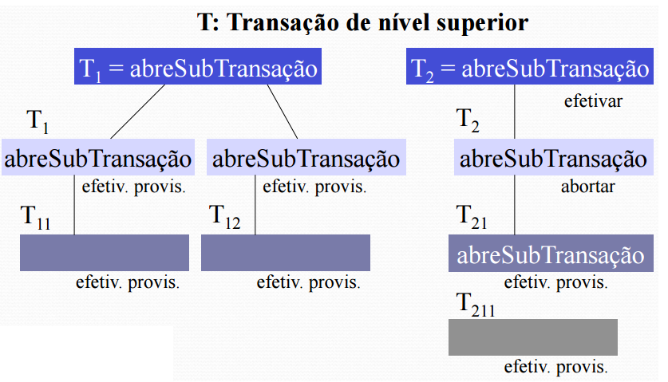
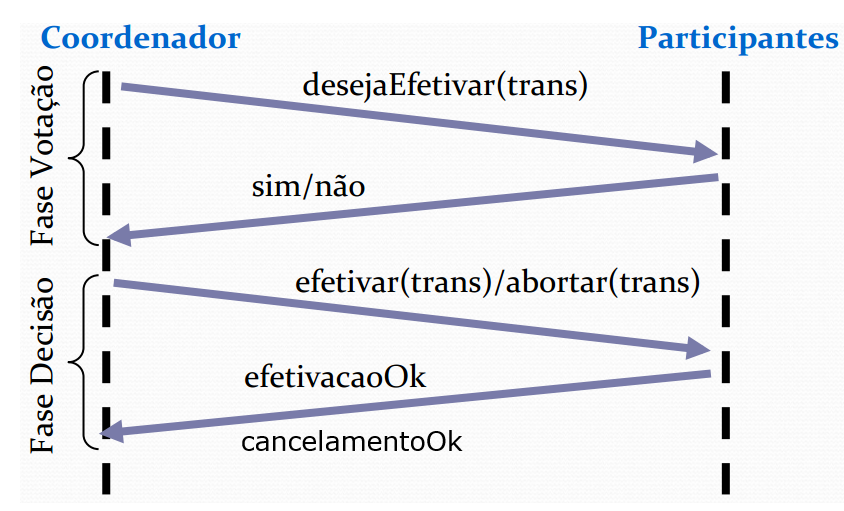
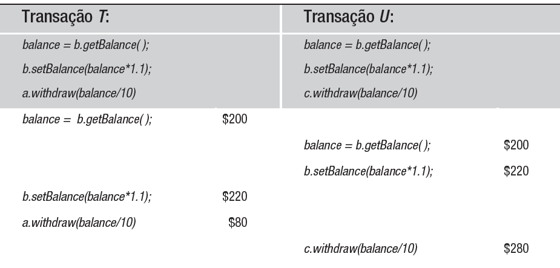
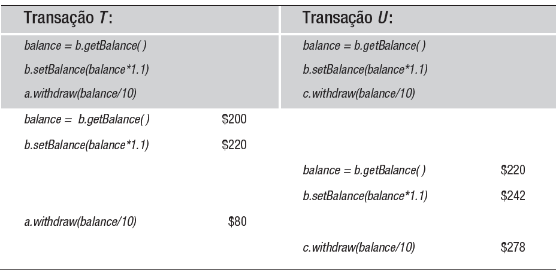
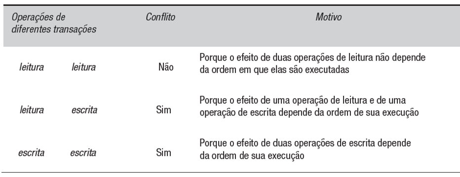
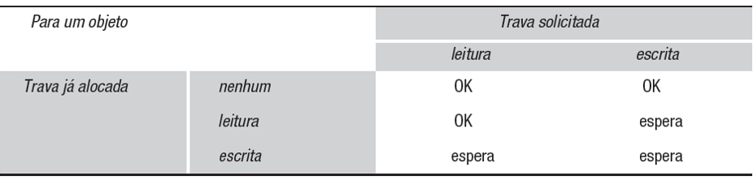

# Concorrência
Quando mais de um usuário altera/utiliza o mesmo recurso

## Transação
Uma unidade de execução. Uma sequência de operações que deve ser executada de modo a garantir a integridade e consistência dos dados.  
Processo Sequencial, mesmo que possa executar de maneira concorrente com outros processos.  

* Ativa - Em execução
    * Efetivação Provisória
        * Efetivada
        * Ainda pode falhar dependendo de outros sistemas ou dados
    * Falha
        * Abortada

Podem ser:
* Planas:
    * Acontece no mesmo plano, uma transação X ativa vários outros servidores no mesmo instance/plano.  
    * A Atomicidade da transação é bem direta, ou tudo ocorre com sucesso em todos os servidores, ou é uma falha.
    * Ou atende, ou não atende. Ou saca o dinheiro, ou não.
* Aninhadas
    * A transação se desmembra em outras subtransações.
    * Aqui podemos ter efetivações parciais, porque uma subtransação pode ser efetivada e a outra pode acabar sendo abortada independentemente.  

### Protocolo de Efetivação
Em uma transação costumamos ter um coordenador e os participantes, dependendo disso para confirmar ou abortar uma transação.  
Aqui entra o protocolo de efetivação, todas transações tem:
* TID - Transaction ID - Exclusivos em um sistema distribuído - Identifica cada uma das transaçoes
* Plana
    * Etapa de Votação
        * Onde decidem se uma transação na qual você é responsável, ocorreu com sucesso ou não
        * Isso ocorre para cada participante, e o coordenador vai perguntando para todos
        * Quando dizem que deu certo, ele não confirma de cara, ele persiste com o status "Preparado"/Efetivação provisória.
        * Quando dá não, a transação cancela de cara.
    * Etapa de Decisão
        * Se todos votarem que sim, o coordenador efetiva a transação e devolve para todos os participantes que deu certo
        * Agora a marcação de efetivação provisória se torna efetivação real
        * Em caso de ter algum não, a transação cancela por completo

* Aninhada
    * A diferença aqui é que na fase da decisão, o coordenador vai decidir se aborta ou continua.
    * Etapa de Votação
    * Etapa de Decisão
        * A decisão pode ser feita por subtransação, nem sempre afetando tudo.

## Transações Atômicas
**ACID - Atomicidade, Consistência, Isolamento e Durabilidade**  

* Atomicidade: Tudo ou nada, ou dá certo, ou não dá
* Consistência: As transações sempre levam de um estado consistente para outro consistente
* Isolamento: Independente da quantidade de transações, independente de concorrência, eles ocorrem de forma isolada, sem que uma interfira na outra
* Durabilidade: As transações concluídas com êxito são persistidas

## Controle de Concorrência
**Equivalência Serial**: As transações disparam uma sequência de operações. Se eu rodo ela sozinha, dá X de alteração nos dados, mas e se eu rodar com N processos em concorrência, dá na mesma? Usamos essa equivalência serial para testar a concorrência.  
Mas como?
* Travas (locks) - Em sistemas mais rígidos (financeiros)
* Otimista - Eventualmente consistente - As transações seguem até estarem prontas para serem confirmadas, só nessa hora o sistema verifica se está certo mesmo, envolvendo verificar se outras transações mexeram no mesmo dado etc..
    * Aqui podemos usar o timestamp como carimbo para garantir que a operação ideal seja efetivada em caso de concorrência, consirando a ordem correta de exeução

Os servidores trabalham com memória persistente e volátil, dependendo da persistente para recuperação em caso de falhas.  
As operações concorrentes ocorrem de forma isolada, e o timestamp é usado para saber qual ocorre primeiro e deveria suceder, ou qual deveria falhar. O que der bom, vai ser persistido, o que não der, vai dar erro.  
Os problemas costumam ocorrer quando uma mesma operação ocorre ao mesmo tempo, e ambas acabam usando uma variável com o valor "antigo", causando inconsistências, conhecido como **atualização perdida**. Para resolver isso, basta que uma execute após a outra, e assim o valor "antigo" seria o da transação rodada primeiro, mantendo a consistência. Fazendo isso, resolvemos o problema com a equivalência serial.  
  
Exemplo:  

Para que as transações sejam serialmente equivalentes, precisamos que todos os pares de operações conflitantes das transações sejam executadas na mesma ordem em todos os objetos que ambas acessam.  
Dessa forma, temos:

### Travas Exclusivas ou Exclusive Locks
Quando aplicamos ela para resolver o controle?  

Mas isso pode levar aos famosos **Deadlocks** ou Impasses.  
Uma alternativa é o controle otimista, em que não temos locks. Nesse cenário não temos uma preocupação muito grande ou rígido, podemos deixar rodar, e o primeiro que foi executado é efetivado, o segundo não.  

### Controle Otimista
* Dropbox/Wikipedia/Docs - Duas pessoas podem mexer no mesmo arquivo, o primeiro que salvar vai ter a alteração efetivada, o outro vai ter um conflito ou perder o dado alterado

Aqui usamos ordenações por carimbo de tempo ou **timestamp** para decidir qual efetivar ou não.  
