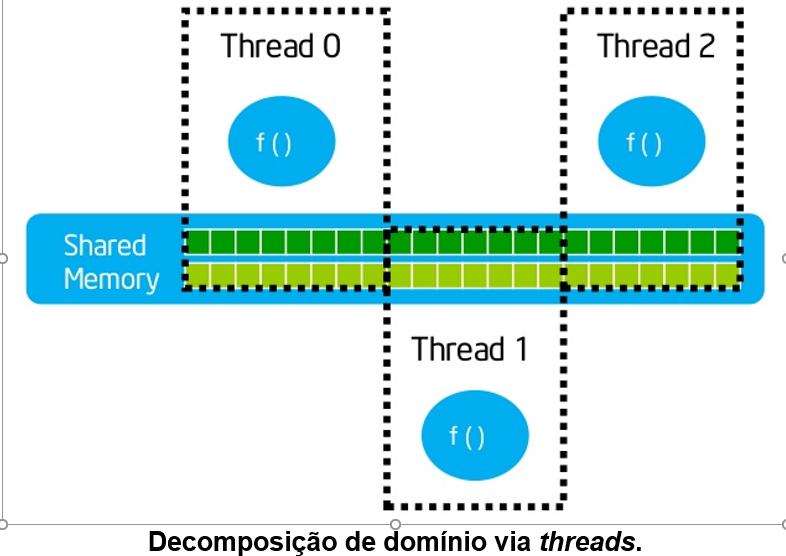

# Memória

## Memória Compartilhada
Quando um espaço de memória é compartilhado entre vários processos. O grande problema disso é a concorrência no acesso, o que degrada o desempenho.

### Estratégias
* Decomposição de Domínio
Exemplo: Descompactar um arquivo .rar:  
  
  
* Decomposição de Tarefas  
Exemplo: Gerar um gráfico e suas funções de regressões com N linhas

## Memória Distribuída
Múltiplos Nós (Computadores) cada um com sua CPU e Memória que se comunicam para se manter atualizados entre si, quando por exemplo há a ausência de alguma informação em um dos nós.  
Problema: Os processos de sincronização são síncronos e consequentemente geram gargalos, onde grande parte do tempo é gasto transferindo a informação de um Nó para outro.  

  

## Memória Compartilhada Distribuída
Cada máquina cede um pouco da sua memória para o bem comum, gerando um bolsão de memória implementado de maneira compartilhada, e assim aumentando a memória física para cada uma das máquinas, que passam a poder usar esse espaço entre si.  

  

  

Para que isso funciona precisamos de algoritmos de gerenciamento

### Algoritmos para uso dessa memória compartilhada
Comparado com o modelo de passagem de mensagens:  
* Permite comunicação de forma assíncrona
    * Salvar e amanhã alguém usa
* Não precisa "trafegar" manualmente, porque vem embutido no gerenciamento e nisso consome menos recursos para que outro processo enxergue
* Problema: Se qualquer computador acabar invadindo a memória pode corromper

No modelo de passagem de mensagens:
* Transmissão de mensagens: send() e receibe()
    * construções normais da programação de memória compartilhada, como semáforos e mutexes
* Precisa ficar empacotando e desempacotando a mensagem

### Como garantir consistência?
* Qual o algoritmo?
* Qual o nível de implementação
* Qual o modelo de consistência?

## Algoritmo DSM
* Distribuição estática e dinâmica dos dados compartilhados - Visa reduzir o tempo de resposta
* Preservação de uma visão coerente dos dados minimizando a sobrecarga de gerenciamento

### Estratégias
* Replicação: Múltiplas cópias de um mesmo dado residam em diferentes memórias locais
    * Funciona bem se o importante é leitura
    * Ou quando a alteração é secionada, ou seja, só altera uma parte cada um. No final faz uma revisão.
* Migração: Migra a única cópia alterável de uma máquina para outro
    * Funciona bem se precisa há a possibilidade de alteração do dado

### Algoritmos
* Leitura Simples / Escrita Simples - SRSW - Simple Read / Simple Write
    * Proíbe replicação mas não requer migração.
    * Servidor central com a cópia única
    * Gera problemas de concorrência, porque todos acessam o mesmo arquivo e concorrem com o outro
    * Funciona bem se só precisam ter uma cópia e quando alteram só muda em um lugar
    * Como tem um baixo desempenho, não é tão usado
    * Tem outros semelhantes que permitem migração, aí ele vai enviando o arquivo para outro computador conforme precisa
* Leitura Múltipla / Escrita Simples - MRSW - Multiple Read / Simple Write
    * Permite a leitura em vários processadores (nós), mas só um tem permissão para alterar uma copia replicada em um certo momento
    * Baseados em invalidação geralmente, em que ao alterar ele invalida todos os demais para que eles atualizem a informação (broadcast)
    * Exemplo: Compra na loja física x Compra do mesmo produto em um e-commerce
        * O primeiro que confirmar fica com o produto, porque só um vai poder alterar por vez
    * Componentes:
        * Gerente: Processador que organiza as escritas
        * Proprietário: Único processador que possui a cópia atualizável dos dados
        * Conjunto Cópia: Processadores que possuem uma cópia do bloco de dados para leitura
* Leitura Múltipla / Escrita Múltipla - MRMW
    * Permitem replicação para leitura e escrita
    * Para preservar a coerência, a atualização de uma cópia gera broadcasting ou multicasting para os demais
    * Minimiza custos de acessos de escrita, mas gera alto tráfego de coerência
    * Exemplo: Monday.com - Dashcoard em que todos podem editar a situação da sua tarefa, e que conforme o tempo passa eles são atualizados e você vê a alteração dos demais
    * Exemplo: Planilha compartilhada

### Implementação dos Mecanismos
Para saber se o dado está ou não na memória local, é necessário executar uma pesquisa na tabela de memória, porque quando você vai acessar, essa memória pode estar com você ou não (estar em outra máquina)

