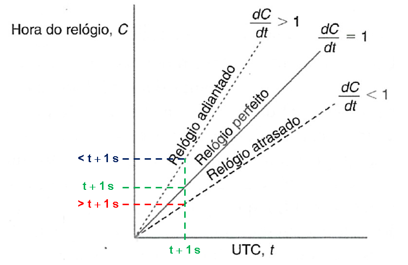
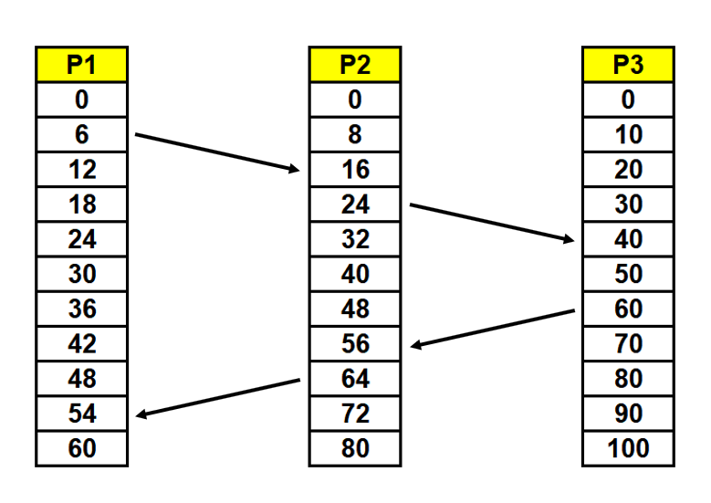
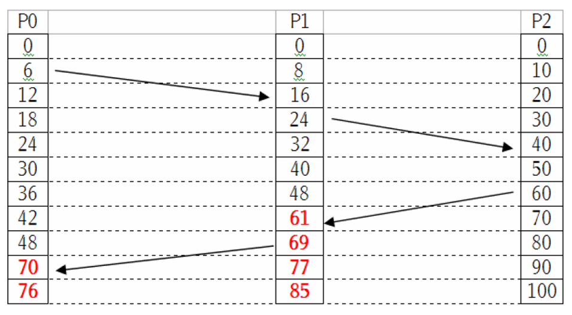

# Sincronização de Processos Distribuídos
Em um sistema centralizado, os programas solicitam o tempo ao sistema que retorna um valor consistente entre as chamadas. Todavia, em sistemas distribuídos em que temos várias máquinas, isso não acontece da mesma forma.  
  
Sabendo, por exemplo, qual arquivo foi alterado pela última vez, cria-se uma relação de dependência para saber qual arquivo deve ser recompilado por ser mais recente ou depender do anterior.  
  
Uma informação incorreta causada pela diferença de horário entre as máquinas pode acarretar em diversos problemas nos sistemas distribuídos.  
  
Mas como fazer o tempo de máquinas espalhadas pelo mundo inteiro serem compatíveis e coerentes entre si? (Como a bolsa de valores atualiza corretamente com fundos do mundo inteiro?)  
  
## Desvio e Derivação de Relógio
Skew - Desvio - Diferença instantânea entre a leitura de dois relógios.  
Drift - Derivação - Relógios que contam o tempo em velocidades diferentes  
Driftrate - Taxa de derivação - Diferença entre um relógio local e um nominal (em perfeito estado).  

Relógios comuns - 10 a -6 segundos de taxa de derivação - 1 segundo a cada 1.000.000 aproximadamente, ou seja, 1 segundo a cada 11,5 dias.  
Relógios de alta precisão de quartzo - 10 a -7 ou 10 a -8 s/s.  
Relógios físicos mais precisos - 10 a -13, ou aproximadamente, 3,171 séculos.  
Esses relógios atômicos definem o **tempo atômico internacional**, e sao usadas como padrão para o tempo real transcorrido, podendo ser usado como referência para sincronizar computadores.  
As unidades de tempo que conhecemos hoje em dia originaram da astronomia, como as rotações da Terra e a transalçao em torno do Sol.  
1 Segundo - 9.192.631.770 períodos de transição entre duas camadas hiper finas do estado fundamental do Césio-133 (Cs133).  
  
UTC - Tempo Universal Coordenado - Padrão internacional de contagem de tempo transmitido regurlamente por satélites e rádios.  
Estações terrestres trazem uma precisão de 0,1 a 10 millisegundos.  
Sistemas de GPS tem precisão de 1 microssegundo.  
Computadores podem receptores agregados podem sincronizar seus relógios com esses sinais, ou receber por meio de linhas telefônicas de organizações como o NIST.  
  
## Método de Cristian
Uso de um servidor de tempo conectado a um dispositivo de fonte UTC para sincronizar os computadores.  
Esse método acaba dependendo do tempo de viagem de ida e volta observados entre cliente e servidor, que quando são suficientemente curtos em comparação com a precisão exigida, acaba sendo suficiente.  
Além disso, quando temos uma concorrência enorme, sempre haverá uma diferença  

## Algoritmo de Berkeley
O servidor de tempo é ativo e fica requisitando o tempo do relógio local de cada computador, de forma que a média desses tempos seria o tempo do sistema distribuído e então ele informa como cada computador pode ajustar seu relógio para bater com o valor.

## Clock Lógico
A sincronização de clock dos computadores em um sistema distribuído não precisa ser absoluta:
1. Se não há interação entre dois processos, não tem a necessidade de sincronizar os clocks
2. Normalmente o que importa é que a ordem dos eventos seja coerente, não necessariamente o tempo em que aconteceram
Então temos:
* Clock Lógico - Quando a consistência interna importa e não quanto os clocks estão próximos do tempo real
* Clock Físico - Os clocks não podem diferir do tempo real mais que um determinado valor

## Algoritmo de Lamport
"aconteceu antes" - a->b - Quando todos os processos concordam que o evento "a" aconteceu antes de "b"  
Se a e b são eventos no mesmo processo e "a" ocorre antes de "b", então a->b é verdadeiro.  
Se a é o evento de envio de uma mensagem e b é o evento de receber mensagem, então a->b é verdadeiro.  
"aconteceu antes" é transitiva, logo se a->b, b->c, então a->c  
Se dois eventos c e d ocorrem em diferentes processos que não trocam mensagem entre si, então c->d não é verdadeiro, nem d->c. Esses eventos são concorrentes e nada pode ser afirmado sobre quando eles ocorreram.  
  
O que o algoritmo tenta fazer é, manter o clock lógico e as preposições verdadeiras, de forma que o tempo de um computador p1 precisa ter uma consistência com relação ao tempo dos outros computadores p2 e p3.  
p1 = x  
p2 = y e y > x  
p3 = z e z > y  
E no caminho da volta:  
p2 = n e n > z  
p1 = m e m > n  
Se algo acontecer em algum dos computadores e algum atraso ocorrer, o algoritmo tenta garantir que o valor a ser retornado nos computadores sejam coerentes com o atraso, levando a um valor de atraso + 1 no mínimo aos demais computadores, assim mantendo o clock lógico.  

