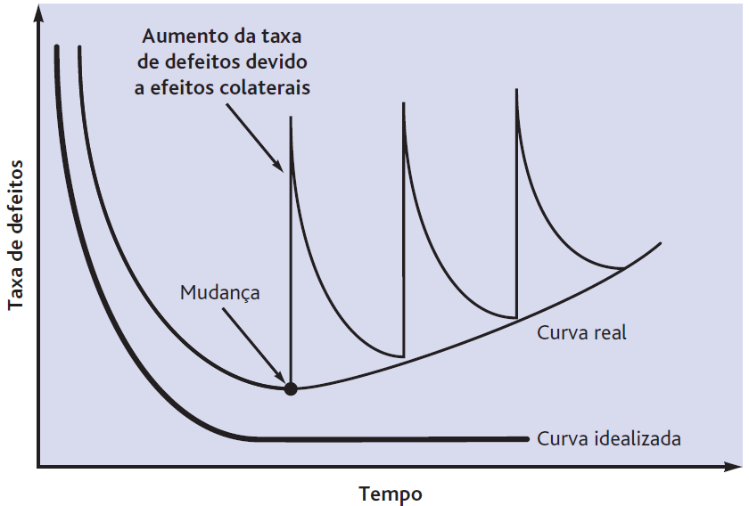
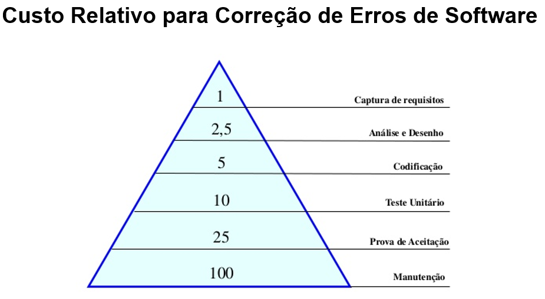
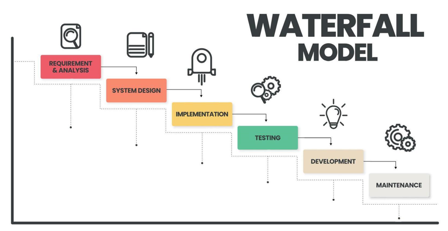
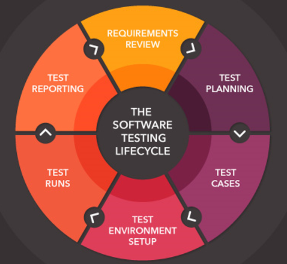
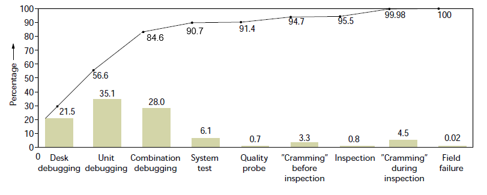
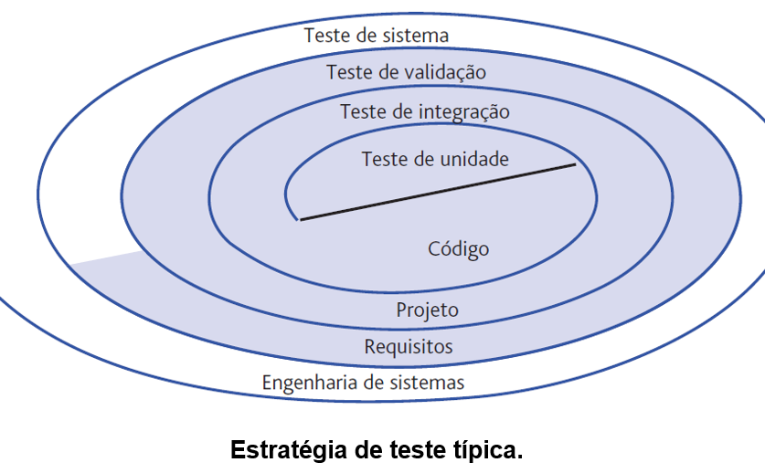

# Aula - Testes de Sistemas

É muito comum que os testes fiquem no fim da fase de desenvolvimento, sem que recursos sejam alocados para tal.  
Pesquisas indicam que o custo de corrigir algo após a codificação custa 10 vezes mais do que corrigir antes, e que após a implementação custa 100 vezes mais.  

Testes geram custos quando feitos com o objetivo errado, quando não há testes principalmente, mas também quando é feito apenas para comprovar que não há erros (só para ter um gráfico).  
A maioria das empresas não reconhecem os frutos dos testes, não querendo arcar com os seus custos, assim levando a um ciclo vicioso.  

## Definições
Segue algumas definições de teste de sistemas:

1. O teste é um processo da aquisição de confiança no fato de que um programa ou sistema faz o que se espera dele (Hetzel).

2. Teste é o processo de executar um programa ou sistema com a finalidade de encontrar erros (Myers).

3. O processo de se experimentar ou avaliar um sistema por meios manuais ou automáticos, de modo a verificar se ele atende às necessidades especificadas ou a identificar diferenças entre os resultados esperados e reais (IEEE).

4. Teste é qualquer atividade que vise a avaliar uma característica ou recurso de um programa ou sistema. Teste é a medida da qualidade do sistema (Hetzel).

## Como costuma ser

A maioria das empresas não possui planejamento nem tem noção dos custos dos testes ou do tempo que seria salvo com eles.  
Testar tudo é inviável, e mesmo quando ocorre e todas as condições possíveis são testadas, não há garantia de que nenhum erro irá ocorrer.  

### Testes de desempenho e estresse
Costumam ser deficiantes e dificilmente projetos alcançam eles.  
Os testes de desempenho – avaliação do desempenho do software como componente de um sistema – combinados aos testes de estresse – avaliação do comportamento do software sob a exigência de recursos em quantidade, frequência ou volume anormais – são realizados para confrontar o software com situações nas quais ele seja muito exigido.  
Mas é muito difícil conseguir simular um ambiente de produção em um laboratório.  

### Testes normais
Os testes de resposta normal (condições normais), de resposta anormal (condições anormais), de segurança (verificação dos mecanismos de proteção do software) e de valor limite (verificação dos valores extremos do domínio de entrada do software) resultam em uma avaliação do funcionamento normal do software.

## Ciclo de testes ideal

O problema é que estudos indicam que 50% dos custos são apenas dos testes. Envolvendo 50% do tempo.  

## O que fazer então?
Precisamos testar o mínimo que cause grande impacto.  

Além disso, precisamos lembrar que softwares são alterados e sofrem correções o tempo todo, o que dificulda ainda mais a situação.  
Para isso, monitores de execução de software se tornam uma boa opção para encontrar problemas.  
Sendo capazes de identificar situações esperadas e anormais, e com isso permitem identificar os problemas e executar correções.  

## Monitores de Execução de SW
Só de ter um, é possível entender com mais facilidade o que acontece com as operações, permitindo identificar o cenário e reproduzir em laboratório com mais facilidade.  
Além disso, os seus custos costumam ser recuperados após 1 ano, dado que facilitam a manutenção e reduzem os erros.  
E essa ideia também é aplicável em Hardware, porque podem ocorrer também. Porque não? Porque não monitorar o SO também?  

### Tipos
* Hardware
    Logic analyzer - Permite acompanhar instrução por instrução após plugar ele no hardware, usando o mesmo código da BIOS/Firmware.  
    Esses monitores não interferem na execução, porque eles coletam informações direto dos barramentos.  
    Quando temos sistemas que não podem falhar, críticos ou de tempo-real, muitas vezes é melhor monitorar o Hardware. O problema é que se tornam específicos para o caso.  
* Software
    Quando colocamos mensagem para gerar um arquivo de log.  
    Seria equivalente a instrumenta a aplicação, instalando "sensores".  
    Acaba usando um pouco da CPU, mas geralmente não gasta tanto (depende).  
    Permitem adicionar diversas informações, como o arquivo, timestamp, mensagens e regular o nível de log.  
* Ambos
    A aplicação pode ficar monitorando a "saúde" da aplicação (hardware), solicitando sinais de vida a cada X tempo ou recebendo (software que envia/recebe).  
