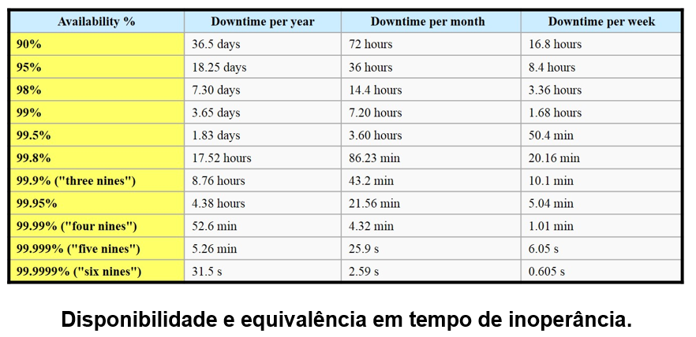
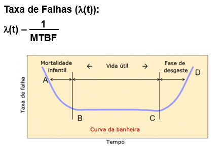
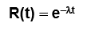
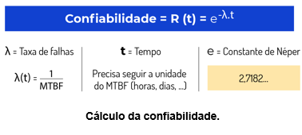
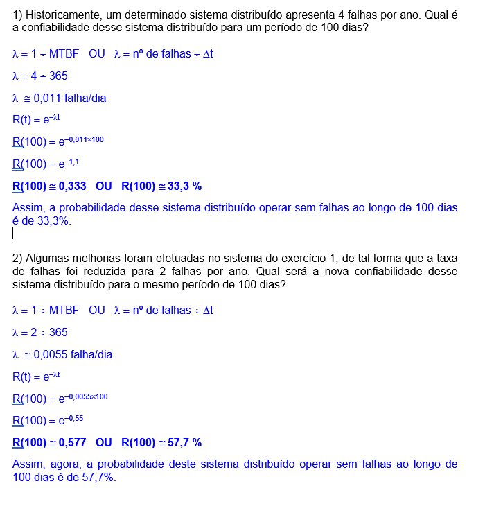
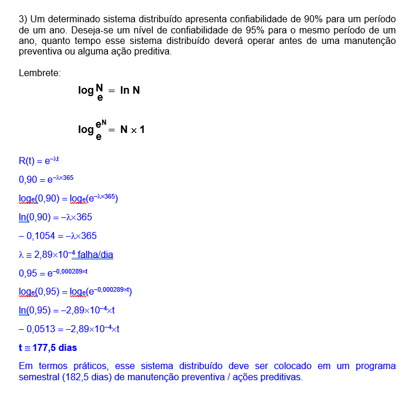
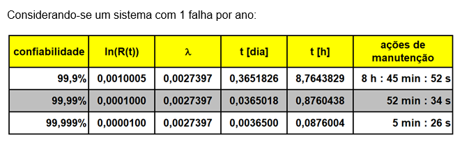
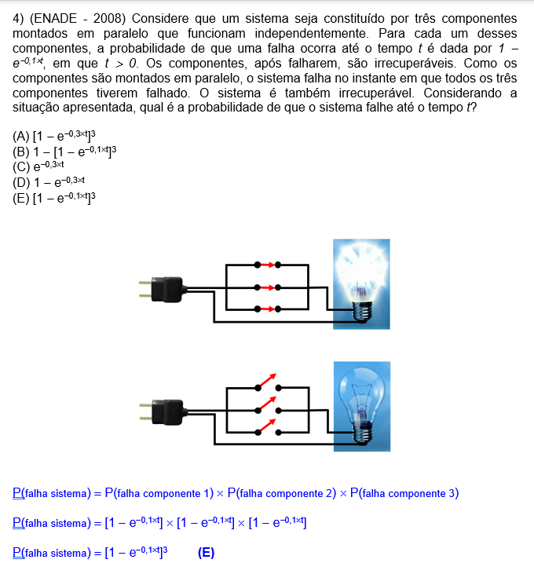
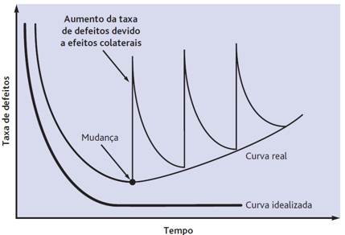

# Tolerância a Falha
Sistemas Distribuídos precisam estar preparados para falhas, evitando que a situação ocorra e controlando ela rapidamente caso aconteça eventualmente.  

## Conceitos - Confiança
* Disponibilidade
    * Estar disponível para seus serviços
    * Probabilidade do sistema estar funcionamento em qualquer momento
    * Definida em instantes de tempo
        * Se fica fora do ar por um milissegundo a cada hora de operação, temos uma disponibilidade de mais de 99,9999%
* Confiabilidade
    * Fornecer os serviços conforme especificado
    * Probabilidade do sistema estar funcionando
    * Definida como o intervalo de tempo em que o sistema estará funcionando sem interrupção
        * Se fica fora do ar por um milissegundo a cada hora de operação, temos uma confiabilidade baixa.
        * Se o sistema nunca cai, mas é desligado por duas semanas, ele tem alta confiabilidade, mas só 96% de disponibilidade
* Segurança
    * Operar sem falhas catastróficas
    * Garantir que nada de catastófrico ocorra caso aconteça alguma falha
    * Sistemas críticos de segurança: Usinas de energia, Foguetes, etc.
* Proteção
    * Proteger o sistema que acessos externos indevidos, evitando que apenas quem deveria acesse.
    * Conexão com internet expõe o sistema a diversas vulnerabilidades que podem ser exploradas.
* Manutenibilidade
    * Facilidade de manutenção após falha ou necessidade
    * Um sistema de alta capacidade de manutenção pode ter alto grau de disponibilidade, em especial se elas forem corrigidas automaticamente.

## Disfunção - Falha - Erro

Por exemplo: Em um determinado computador, a fonte de alimentação apresenta um problema que altera a tensão de alimentação da placa-mãe (falha). Por causa disso, alguns bits da memória RAM passam a ter os seus valores trocados de 1 para 0 (erro), impossibilitando o boot deste computador (disfunção).

### Disfunção
Algo que percebemos diretamente, é notório, visível.  

### Falha
Problema interno, o que causou o problema, o que funcinou diferente

### Erro
O que aconteceu por conta da falha, causando X consequências.

## MTTR e MTBM

### MTTR - Tempo Médio para Reparos
Tempo médio para reparos

### MTBM - Mean Time Between Maintenance actions
Tempo médio entre ações de manutenção: reparos, inspeções, ações preventivas, ações preditivas.

### MTBF - Tempo Médio entre Falhas
Horas de trabalho em bom funcionamento / Número de paradas para manutenção corretiva  

Taxa de Falhas = 1 / MTBF  
  

Equipamentos costumam ser testados colocando carga de processamento e de uso durante um tempo, verificando se algo ocorre durante um período de tempo para saber se vai durar - **burn-in**  
Equipamentos que ficam rodando por um tempo para testar - **run-in**  

## Confiabilidade
Confiabilidade do sistema operar até o instante t.

  

Não é certo dizer que um sistema tem uma confiabilidade de X%. O correto seria dizer que o sistema tem uma confiabilidade de 97% ao longo de um ano. O que é diferente de dizer que irá operar 9% do tempo total independente do tempo em que operar.  

É importante enfatizar que a confiabilidade não é linear em comparação com a quantidade de error.  

**Sempre que ver o operador AND: Multiplicação. OR: Soma**  
Qual a chance de ocorrer X AND Y? = Probabilidade de X * Probabilidade de Y.  

## Mas e em Softwares?

Conforme mais funcionalidades são adicionadas, mais funcionalidades podem apresentar problemas, por isso a tendência é que a taxa de defeitos aumente sempre. Apesar de que o ideal seja reduzir o crescimento de erros.  
  
